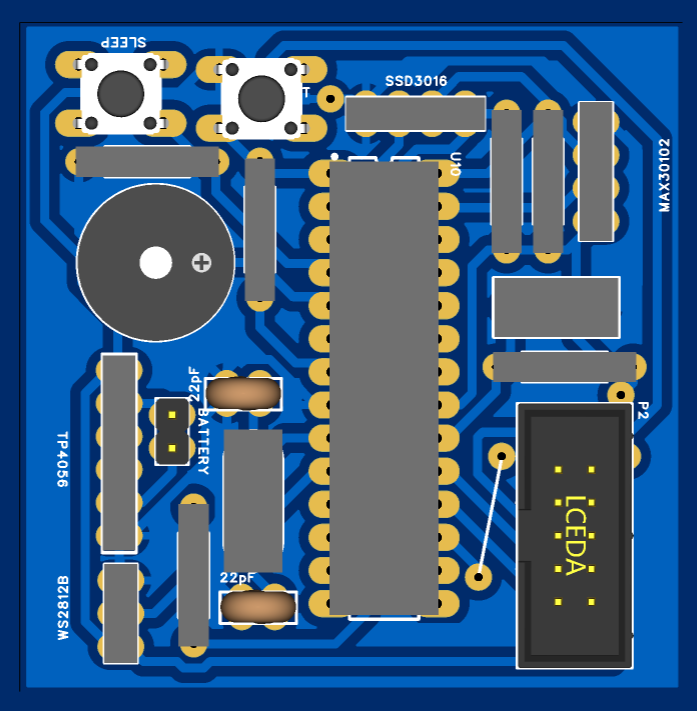
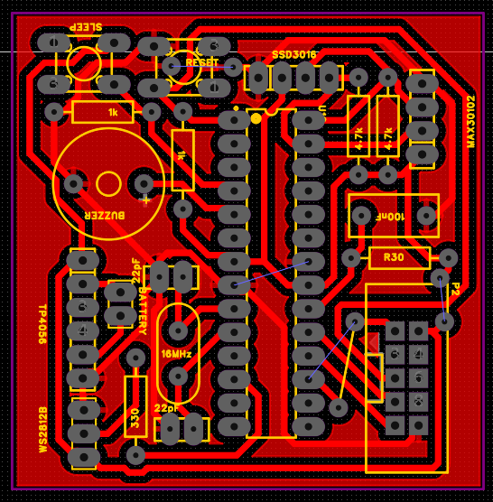

# AURA LIGHT — Heart Rate & HRV Monitoring Device

A low-cost, portable embedded system for real-time heart rate (BPM) and heart rate variability (HRV) monitoring, built on the ATmega328P microcontroller. The device measures PPG signals via the MAX30102 sensor and translates physiological data into an intuitive color-coded LED display.


---

## Table of Contents

- [Overview](#overview)
- [Features](#features)
- [Hardware](#hardware)
  - [Components](#components)
  - [Pin Connections](#pin-connections)
- [Software](#software)
  - [Dependencies](#dependencies)
  - [Key Algorithms](#key-algorithms)
- [Building & Flashing](#building--flashing)
- [Usage](#usage)
- [Health Status Indicators](#health-status-indicators)
- [Results](#results)
- [Project Structure](#project-structure)
- [Future Work](#future-work)
- [References](#references)

---

## Overview

AURA LIGHT is a wearable embedded system that provides users with a glanceable, real-time view of their physiological state. It measures:

- **Heart Rate (BPM)** — via photoplethysmography (PPG) using the MAX30102 sensor
- **Heart Rate Variability (RMSSD)** — a time-domain HRV metric strongly correlated with autonomic nervous system (ANS) balance

Results are displayed numerically on an OLED screen and visually through a color-coded WS2812B LED ring: **green** (balanced), **yellow** (unbalanced), or **red** (low / high stress).

---

## Features

- Real-time BPM measurement averaged over a 16-sample circular buffer
- HRV calculation using the RMSSD metric (5-sample IBI buffer)
- SSD1306 OLED display showing BPM, HRV (ms), raw IR value, and health status label
- WS2812B LED ring with three-level color-coded stress feedback
- Power-saving sleep mode triggered after 60 seconds of inactivity
- Wake-up via external interrupt (push button on PD2)
- Low-level DC removal and FIR low-pass filtering for robust beat detection
- Written entirely in bare-metal Embedded C — no Arduino framework

---

## Hardware

### Components

| Component | Part | Purpose |
|---|---|---|
| Microcontroller | ATmega328P (8 MHz) | Central processing unit |
| Pulse Sensor | MAX30102 | PPG data acquisition via I2C |
| Display | SSD1306 OLED (128×64) | Real-time numerical readout |
| LED Ring | WS2812B strip (14 LEDs) | Color-coded health feedback |
| Battery | Li-Po 3.7 V 800 mAh | Portable power |
| Charger Module | TP4056 (Micro USB) | Battery charging with protection |
| Pull-up Resistors | 4.7 kΩ × 2 | I2C bus (SDA/SCL) |
| Current Limiting | 330 Ω | WS2812B data line |
| Button Pull-downs | 1 kΩ × 2 | Stable logic for push buttons |


*Assembled prototype: MAX30102 sensor mounted on the wrist strap (left) and the ATmega328P + OLED enclosure (right), prior to final assembly.*

### Pin Connections

| ATmega328P Pin | Connected To |
|---|---|
| PC4 (SDA) | MAX30102 SDA, SSD1306 SDA |
| PC5 (SCL) | MAX30102 SCL, SSD1306 SCL |
| PD6 | WS2812B data input |
| PD2 (INT0) | Wake-up push button |
| PB4 / PB5 | Mode / Reset push buttons |

### PCB Design

| 3D Render | PCB Layout |
|---|---|
|  |  |

The custom PCB integrates the ATmega328P, MAX30102 breakout header, SSD1306 OLED header, WS2812B LED ring driver, TP4056 Li-Po charging circuit, and sleep/reset push buttons on a single board.

---

## Software

### Dependencies

All drivers are implemented from scratch in bare-metal C. No external libraries are required. The following AVR-libc headers are used:

```c
#include <avr/io.h>
#include <util/delay.h>
#include <stdint.h>
#include <string.h>
#include <stdbool.h>
#include <avr/interrupt.h>
#include <avr/sleep.h>
```

Toolchain requirements:

- `avr-gcc`
- `avr-libc`
- `avrdude` (for flashing)
- AVR-ISP programmer (e.g., USBasp) connected via the on-board AVR-ISP header

### Key Algorithms

**Beat Detection (`checkForBeat`)**

Raw IR samples from the MAX30102 FIFO are first passed through an IIR DC estimator (`averageDCEstimator`) to remove the DC baseline, then through a 12-tap FIR low-pass filter (`lowPassFIRFilter`) to smooth the AC PPG waveform. A beat is detected at each positive zero-crossing of the filtered signal, provided the peak-to-peak amplitude falls within the valid range (20–1000 ADC counts).

**BPM Calculation**

The inter-beat interval (IBI) is computed as the elapsed milliseconds between consecutive valid beats (valid range: 300–2000 ms, corresponding to 30–200 BPM). BPM values are stored in a 16-element circular buffer and averaged to reduce noise.

**HRV — RMSSD**

The Root Mean Square of Successive Differences is computed over the 5 most recent IBI values:

```
RMSSD = sqrt( mean( (IBI[i] - IBI[i-1])^2 ) )
```

Successive differences larger than ±400 ms are filtered out as artifacts. Integer square root is computed with a fast bit-manipulation algorithm (`int_sqrt`).

**Display Update**

The OLED display refreshes every 500 ms (50 × 10 ms main-loop ticks). Eight pages of the SSD1306 frame buffer are written via I2C using a custom 5×7 bitmap font.

**WS2812B Control**

LEDs are driven bit-bang style using precisely timed `nop` sequences calibrated for 8 MHz. Brightness scaling and color-wipe effects are implemented in software.

**Sleep Management**

After 60 seconds of inactivity (no finger detected, i.e., IR < 10 000 ADC counts), the device blanks the display and LEDs, then enters `SLEEP_MODE_PWR_DOWN`. A falling-edge interrupt on INT0 (PD2) wakes the MCU.

---

## Building & Flashing

```bash
# Compile
avr-gcc -mmcu=atmega328p -DF_CPU=8000000UL -Os -o main.elf main.c

# Convert to hex
avr-objcopy -O ihex main.elf main.hex

# Flash (USBasp example)
avrdude -c usbasp -p m328p -U flash:w:main.hex
```

> **Fuse bits:** Ensure the MCU is configured for the internal 8 MHz oscillator (or an external 8 MHz crystal, depending on your hardware). Verify fuse settings with `avrdude` before flashing.

---

## Usage

1. Power on the device using the push button (SW1).
2. Place your finger firmly on the MAX30102 sensor on the wrist strap.
3. Wait approximately **60–90 seconds** for the BPM and HRV readings to stabilise.
4. The OLED will display:
   - `BPM` — current heart rate
   - `HRV` — current RMSSD value in ms
   - Health status label (see below)
   - Raw IR value (bottom-right, for diagnostics)
5. The LED ring reflects your current health status colour.
6. Remove your finger or leave the device idle for 60 seconds to trigger sleep mode. Press the button to wake it up.

---

## Health Status Indicators

| LED Colour | OLED Label | Condition | Meaning |
|---|---|---|---|
| ⚪ White | `WAIT` | HRV = 0 and BPM = 0 | Acquiring signal |
| 🟢 Green | `BALANCED` | HRV ≥ 67 ms **or** BPM ≤ 70 | Healthy, parasympathetic dominance |
| 🟡 Yellow | `UNBALANCED` | HRV ≥ 47 ms **or** BPM ≤ 80 | Moderate stress or activity |
| 🔴 Red | `LOW` | All other cases | High stress / low HRV |

HRV reference: a resting RMSSD of 30–50 ms is generally considered a healthy baseline for short-term measurements.

---

## Results

*The device shown above displays a live reading (BPM 61, HRV 121, status BALANCED) from the OLED and the corresponding green LED ring.*

Tested against a reference heart rate of 86 BPM over a 100-second window (readings taken every 5 seconds starting at t = 60 s):

| Metric | Mean | Std Dev | Notes |
|---|---|---|---|
| BPM | 85.9 | 5.1 | True value: 86 BPM; MAE = 0.1 BPM |
| HRV (RMSSD) | 45 ms | 3.7 ms | CV = 8.2%; range 38–51 ms |

- 95% confidence interval for BPM: **(82.4, 89.4)**
- All HRV readings fell within the healthy physiological range of 30–50 ms.
- No abnormal inverse HR–HRV correlation was observed, confirming algorithm robustness.

---

## Project Structure

```
.
├── main.c          # Full firmware source (bare-metal Embedded C)
└── README.md       # This file
```

The entire firmware lives in `main.c` and includes:

- TWI/I2C driver
- SSD1306 OLED driver (command, clear, draw char/string, display)
- MAX30102 FIFO reader
- WS2812B bit-bang driver
- Beat detection (DC estimator + FIR filter + zero-crossing)
- BPM & RMSSD calculation
- Sleep / wake-up management
- Health status logic & display rendering

---

## Future Work

- **On-device history** — trend display over hours/days using external EEPROM or flash
- **Bluetooth LE** — sync data to a companion mobile app for long-term logging and visualisation
- **Improved motion rejection** — accelerometer-based artifact removal for active use
- **SpO₂ measurement** — the MAX30102 supports pulse oximetry; the red-channel data is already read but not yet processed

---

## References

- Atmel. *ATmega328P Datasheet*. 2015.
- Shaffer, F. & Ginsberg, J.P. "An Overview of Heart Rate Variability Metrics and Norms." *Frontiers in Public Health*, vol. 5, 2017. https://doi.org/10.3389/fpubh.2017.00258
- SparkFun MAX3010x Sensor Library (algorithm reference). https://github.com/sparkfun/SparkFun_MAX3010x_Sensor_Library
- Maxim Integrated. *MAX30102 Datasheet*.
- WS2812B Datasheet — Intelligent Control LED Integrated Light Source.

---

*Course: Embedded System Laboratory | Index No: 16782 | Date: 15.09.2025*
